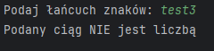
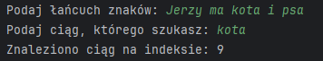
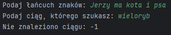
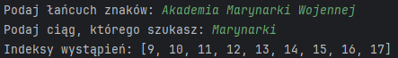
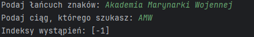
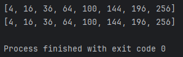
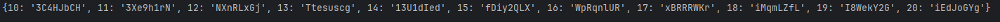
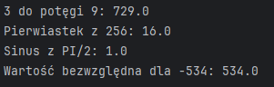

# Task-01
Napisz program (na dwa sposoby), który sprawdza czy wczytany pojedynczy znak jest cyfrą lub nie. Jeśli wczytamy więcej znaków, należy wziąć tylko pierwszy.
Hint: skorzystaj z funkcji isdigit() i isinstance().

[Task-01](task-01.py).

# Task-02
Napisz program, który sprawdza czy wczytany łańcuch znakowy jest liczbą lub nie. Muszą być wczytane co najmniej dwa znaki.
Hint: skorzystaj z funkcji all().

[Task-02](task-02.py).

# Task-03
Napisz program, który szuka określonego ciągu znaków w łańcuchu znakowym i zwraca indeks pierwszego wystąpienia ciągu lub -1, gdy nie ma takiego ciągu.
Hint: skorzystaj z funkcji find().

[Task-03](task-03.py).

# Task-04
Napisz program, który szuka określonego ciągu znaków w łańcuchu znakowym i zwraca indeksy wszystkich wystąpień ciągu lub -1, gdy nie ma takiego ciągu.
Hint: skorzystaj z funkcji split().

[Task-04](task-04.py).

# Task-05
Napisz program (na dwa sposoby), który szuka pierwiastków liczb od 1 do 256 (włącznie) podzielnych bez reszty przez 2.
Hint: skorzystaj z modułu math i z tzw. 'list comprehensions'.

[Task-05](task-05.py)

# Task-06
Napisz program, który tworzy słownik o nazwie zawierającej Twój numer albumu.
Kluczami powinny być liczby od 10 do 20, a wartościami pseudolosowe łańcuch znaków o długości 8.
Hint: skorzystaj z modułów string i random.

[Task-06](task-06.py)

# Task-07
Stwórz folder utils, a w nim plik 'obliczenia.py', w którym należy zaimplementować cztery wybrane funkcje matematyczne z modułu math.
Następnie należy utworzyć plik skrypt7-nr_albumu.py i zaimportować w nim ww. funkcje do obliczeń na przykładowych wartościach.

[Task-07](skrypt7_25127.py) [Task-07-obliczenia.py](obliczenia.py)

# Task-08
Napisz program, który generuje losowy ciąg znaków o długości 100, a następnie utwórz słownik którego kluczami będą unikalne znaki występujące w ciągu, a wartościami liczba ich wystąpień w ciągu znakowym. 
Utwórz listę, której każdy element to krotka (tupla), zawierająca kolejny klucz z ww. słownika i odpowiadającą mu wartość liczbową.
Hint: skorzystaj z modułu collections i klasy Counter().

[Task-08](task-08.py)

