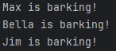
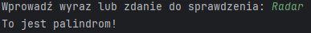

# Task-01
Napisz program (na dwa sposoby), który sprawdza czy wczytany pojedynczy znak jest cyfrą lub nie. Jeśli wczytamy więcej znaków, należy wziąć tylko pierwszy.
Hint: skorzystaj z funkcji isdigit() i isinstance().

[Task-01](task-01.py).

# Task-02
Napisz program, który sprawdza czy wczytany łańcuch znakowy jest liczbą lub nie. Muszą być wczytane co najmniej dwa znaki.
Hint: skorzystaj z funkcji all().

[Task-02](task-02.py).

# Task-03
Napisz program, który szuka określonego ciągu znaków w łańcuchu znakowym i zwraca indeks pierwszego wystąpienia ciągu lub -1, gdy nie ma takiego ciągu.
Hint: skorzystaj z funkcji find().

[Task-03](task-03.py).

# Task-04
Napisz program, który szuka określonego ciągu znaków w łańcuchu znakowym i zwraca indeksy wszystkich wystąpień ciągu lub -1, gdy nie ma takiego ciągu.
Hint: skorzystaj z funkcji split().

[Task-04](task-04.py).

# Task-05
Napisz program (na dwa sposoby), który szuka pierwiastków liczb od 1 do 256 (włącznie) podzielnych bez reszty przez 2.
Hint: skorzystaj z modułu math i z tzw. 'list comprehensions'.

[Task-05](task-05.py)

# Task-06
Napisz program, który tworzy słownik o nazwie zawierającej Twój numer albumu.
Kluczami powinny być liczby od 10 do 20, a wartościami pseudolosowe łańcuch znaków o długości 8.
Hint: skorzystaj z modułów string i random.

[Task-06](task-06.py)

# Task-07
Stwórz folder utils, a w nim plik 'obliczenia.py', w którym należy zaimplementować cztery wybrane funkcje matematyczne z modułu math.
Następnie należy utworzyć plik skrypt7-nr_albumu.py i zaimportować w nim ww. funkcje do obliczeń na przykładowych wartościach.

[Task-07](skrypt7_25127.py) [Task-07-obliczenia.py](obliczenia.py)

# Task-08
Napisz program, który generuje losowy ciąg znaków o długości 100, a następnie utwórz słownik którego kluczami będą unikalne znaki występujące w ciągu, a wartościami liczba ich wystąpień w ciągu znakowym. 
Utwórz listę, której każdy element to krotka (tupla), zawierająca kolejny klucz z ww. słownika i odpowiadającą mu wartość liczbową.
Hint: skorzystaj z modułu collections i klasy Counter().

[Task-08](task-08.py)

# Task-09
Stwórz klasy Vehicle i Car z polami nazwa, rok_produkcji i przebieg oraz metodami is_old() i is_long_mileage(). 
Stwórz po jednym obiekcie dla każdej z klas oraz trzeci obiekt, gdzie klasa Car dziedziczy z klasy Vehicle. 
Dla każdego z obiektów wywołaj obie metody, co najmniej raz użyj dekoratora @property w każdym z trzech przypadków.

[Task-09](task-09.py)

# Task-10
Napisz program, który korzystająć z metody chr() wygeneruje łańcuch znakowy z alfabetem, czyli 'abc....xyz'. 
Do pliku alfabet1-numeralbumu.txt zapisz wygenerowany łańcuch znakowy, a do pliku alfabet2-numeralbumu.txt zapisz litery z ww. łańcucha znakowego, tylko że każda litera ma się znaleźć w osobnej linii w pliku.
Hint: oprócz funkcji write() skorzystaj również z menadżera kontekstu with, żeby nie zapomnieć o zamknięciu pliku.

[Task-10](task-10.py)

# Task-11
Odwrócić sentencję podaną przez użytkownika.

[Task-11](task-11.py)

# Task-12
Zamienić wszystkie litery o na 0, e na 3, i na 1, a na 4 w podanej przez użytkownika sentencji.

[Task-12](task-12.py)

# Task-13
Używając pętli wyświetl liczby w przedziale od 1 do 50 oprócz liczb podzielnych przez 3.

[Task-13](task-13.py)

# Task-14
Używając pętli wyświetl liczby w przedziale od 1 do 100 podzielne przez 3 i 4 oraz podaj ich liczbę.

[Task-14](task-14.py)

# Task-15
Używając pętli dodawaj do wcześniej zadeklarowanej tabeli liczby z przedziału od 1 do 100, które są podzielne przez 3 lub podzielne przez 5.

[Task-15](task-15.py)

# Task-16
Napisz prostą funkcję o nazwie potega(), przyjmującą jeden argument, podnoszącą podaną liczbę do trzeciej potęgi.

[Task-16](task-16.py)

# Task-17
Stwórz klasę o nazwie Dog, która będzie posiadała zmienne takie jak: name, age, coat_color. Dodatkowo klasa posiada funkcje sound(), po wywołaniu której wypisywany jest tekst: {name} is barking! Stworzyć 3 obiekty klasy Dog.

[Task-17](task-17.py)

# Task-18
Stworzyć plik funkcje.py, w którym należy zaimplementować funkcję: dodawanie, odejmowanie, dzielenie, mnożenie oraz modulo. W pliku main.py zaimportować plik funkcje.py i wykorzystać zaimportowane funkcje na przykładowych wartościach.

[Task-18](task-18.py)

# Task-19
Sprawdź czy wyraz bądź zdanie podane przez użytkownika jest palindromem.

[Task-19](task-19.py)

# Task-20
Prosta gra, program generuje losową liczbę od 1 do 100, użytkownik ma odgadnąć liczbę, jeżeli nie trafi ma zostać wyświetlona podpowiedź czy za duża czy za mała liczba.

[Task-20](task-20.py)

