# Exercise-01

Write a SQL query to select the sex and body mass columns from the little_penguins in that order, sorted such that the largest body mass appears first.

```sql
SELECT sex, body_mass_g FROM little_penguins ORDER BY body_mass_g DESC
```

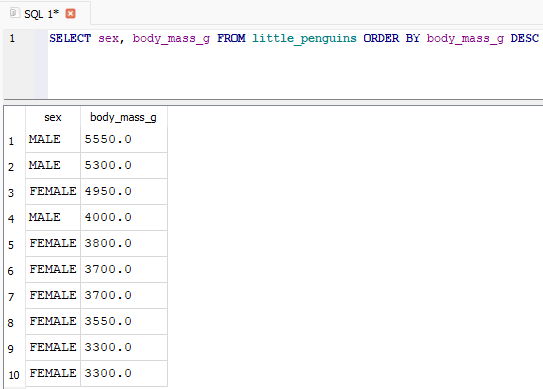

# Exercise-02

Write a SQL query to select the islands and species from rows 50 to 60 inclusive of the penguins table. Your result should have 11 rows.

```sql
SELECT island, species
FROM penguins
WHERE rowid BETWEEN 50 AND 60;
```

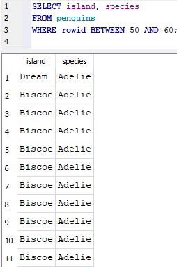

# Exercise-03

Modify your query to select distinct combinations of island and species from the same rows and compare the result to what you got in part 1.

```sql
SELECT DISTINCT island, species
FROM penguins
WHERE rowid BETWEEN 50 AND 60;

```

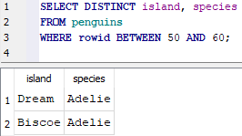

# Exercise-04

Write a query to select the body masses from penguins that are less than 3000.0 grams.

```sql
SELECT body_mass_g
FROM penguins
WHERE body_mass_g < 3000.0;

```

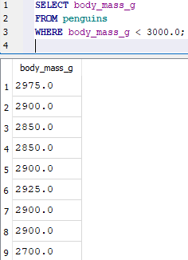

# Exercise-05

Write another query to select the species and sex of penguins that weight less than 3000.0 grams. This shows that the columns displayed and those used in filtering are independent of each other.

```sql
SELECT species, sex
FROM penguins
WHERE body_mass_g < 3000.0;
```

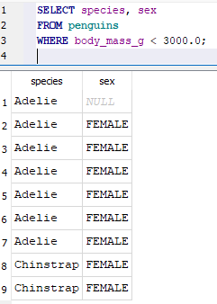

# Exercise-06

Use the not operator to select penguins that are not Gentoos.

```sql
SELECT *
FROM penguins
WHERE NOT species = 'Gentoo';
```

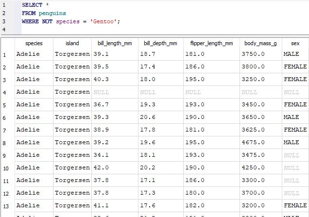

# Exercise-07

SQL's or is an inclusive or: it succeeds if either or both conditions are true. SQL does not provide a specific operator for exclusive or, which is true if either but not both conditions are true, but the same effect can be achieved using and, or, and not. Write a query to select penguins that are female or on Torgersen Island but not both.

```sql
SELECT *
FROM penguins
WHERE
    (sex = 'female' OR island = 'Torgersen')
    AND NOT (sex = 'female' AND island = 'Torgersen');
```

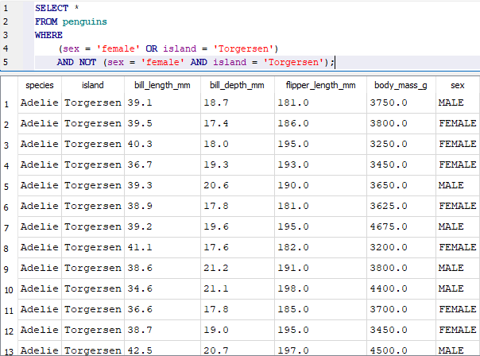

# Exercise-08

Write a single query that calculates and returns:
A column called what_where that has the species and island of each penguin separated by a single space.

```sql
SELECT species, island, species || ' ' || island AS what_where
FROM penguins;
```

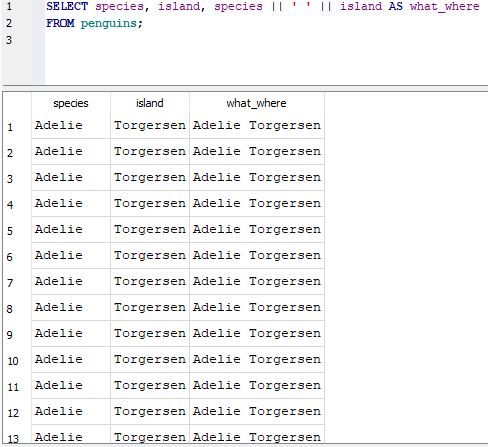

# Exercise-09

Write a single query that calculates and returns:
A column called bill_ratio that has the ratio of bill length to bill depth.

```sql
SELECT bill_length_mm * 1.0 / bill_depth_mm AS bill_ratio
FROM penguins;
```

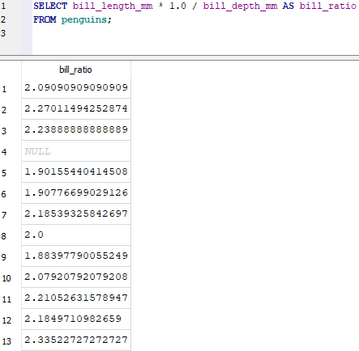

# Exercise-10

Use SQLite's .nullvalue command to change the printed representation of null to the string null and then re-run the previous query.

.nullvalue

```sql
SELECT bill_length_mm * 1.0 / bill_depth_mm AS bill_ratio
FROM penguins;
```

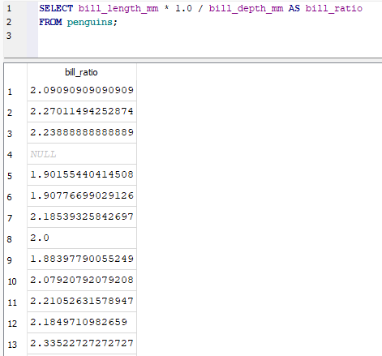

# Exercise-11

Write a query to find penguins whose body mass is known but whose sex is not.

```sql
SELECT *
FROM penguins
WHERE body_mass_g IS NOT NULL AND sex IS NULL;
```

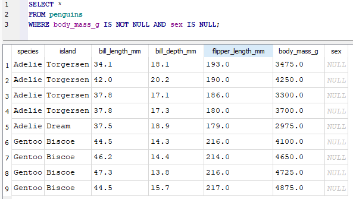

# Exercise-12

Write another query to find penguins whose sex is known but whose body mass is not.

```sql
SELECT *
FROM penguins
WHERE sex IS NOT NULL AND body_mass_g IS NULL;
```

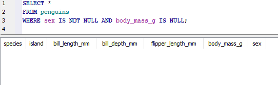

# Exercise-13

What is the average body mass of penguins that weight more than 3000.0 grams?

```sql
SELECT AVG(body_mass_g) AS average_body_mass
FROM penguins
WHERE body_mass_g > 3000.0;
```

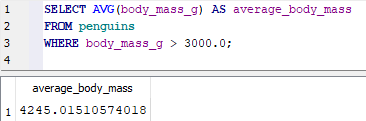

# Exercise-14

How many different body masses are in the penguins dataset?

```sql
SELECT COUNT(DISTINCT body_mass_g) AS num_unique_body_masses
FROM penguins;
```

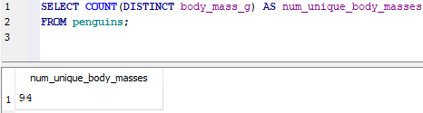

# Exercise-15

Explain why the output of the previous query has a blank line before the rows for female and male penguins.

```
W bazie danych penguins są pingwiny, dla których kolumna sex ma wartość NULL - czyli brak informacji o płci. SQLite pokazuje tę wartość jako pustą.
```

Write a query that shows each distinct body mass in the penguin dataset and the number of penguins that weigh that much.

```sql
SELECT body_mass_g, COUNT(*) AS num_penguins
FROM penguins
GROUP BY body_mass_g
ORDER BY body_mass_g;
```

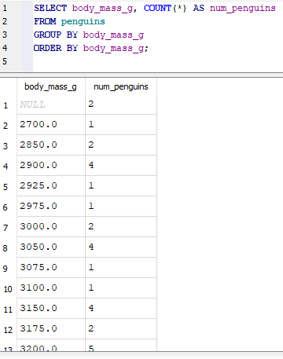

# Exercise-16

Write a query that uses filter to calculate the average body masses of heavy penguins (those over 4500 grams) and light penguins (those under 3500 grams) simultaneously. Is it possible to do this using where instead of filter?

```sql
SELECT
  AVG(body_mass_g) FILTER (WHERE body_mass_g > 4500) AS avg_heavy,
  AVG(body_mass_g) FILTER (WHERE body_mass_g < 3500) AS avg_light
FROM penguins;
```

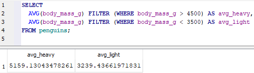

# Exercise-17

Using an in-memory database, define a table called notes with two text columns author and note and then add three or four rows. Use a query to check that the notes have been stored and that you can (for example) select by author name.

What happens if you try to insert too many or too few values into notes? What happens if you insert a number instead of a string into the note field?

```sql
CREATE TABLE notes (author TEXT, note TEXT);
INSERT INTO notes (author, note) VALUES ('Krzysztof', 'Zrob pranie.');
INSERT INTO notes (author, note) VALUES ('Adam', 'Posprzataj pokoj.');
INSERT INTO notes (author, note) VALUES ('Tomasz', 'Zrob zakupy.');
SELECT * FROM notes;
Krzysztof|Zrob pranie.
Adam|Posprzataj pokoj.
Tomasz|Zrob zakupy.
SELECT * FROM notes WHERE author = 'Krzysztof';
Krzysztof|Zrob pranie.
INSERT INTO notes VALUES ('Oskar', 'Nowa notatka', 'Dodatkowa wartosc');
Parse error: table notes has 2 columns but 3 values were supplied
INSERT INTO note VALUES ('Ewa');
Parse error: no such table: note
INSERT INTO notes (author, note) VALUES ('Franek', 12345);
SELECT * FROM notes WHERE author = 'Franek';
```

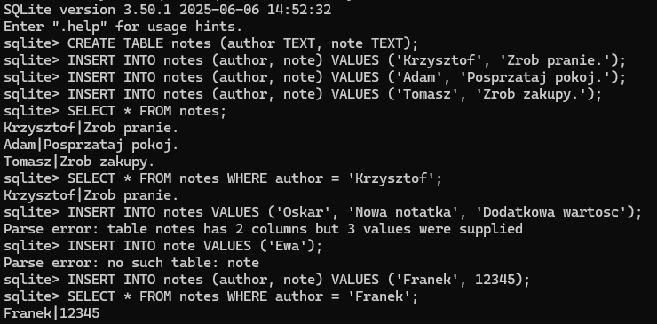

# Exercise-18

What happens if you try to delete rows that don't exist (e.g., all entries in work that refer to juna)?

```sql
DELETE FROM work WHERE name = 'juna';
```

```
Usunięte zostanie 0 wierszy. Baza pozostanie bez zmian, natomiast zapytanie wykona się poprawnie.
```

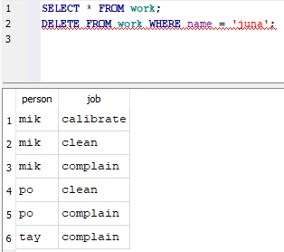

# Exercise-19

Re-create the notes table in an in-memory database and then use SQLite's .output and .dump commands to save the database to a file called notes.sql. Inspect the contents of this file: how has your data been stored?

```sql
.output notes.sql
.dump
.output stdout
```

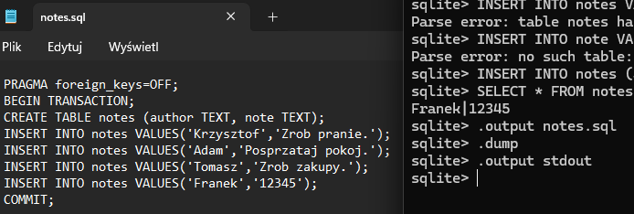

# Exercise-20

Start a fresh SQLite session and load notes.sql using the .read command. Inspect the database using .schema and select \*: is everything as you expected?

```sql
.read notes.sql
.schema
```

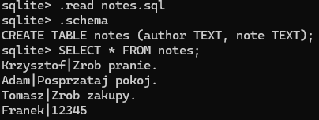

# Exercise-21

```sql
select *
from work inner join job
    on work.job = job.name;
```

Re-run the query shown above using where job = name instead of the full table.name notation. Is the shortened form easier or harder to read and more or less likely to cause errors?

```sql
select *
from work inner join job
    on job = name;
```

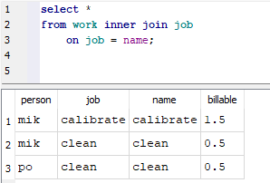
